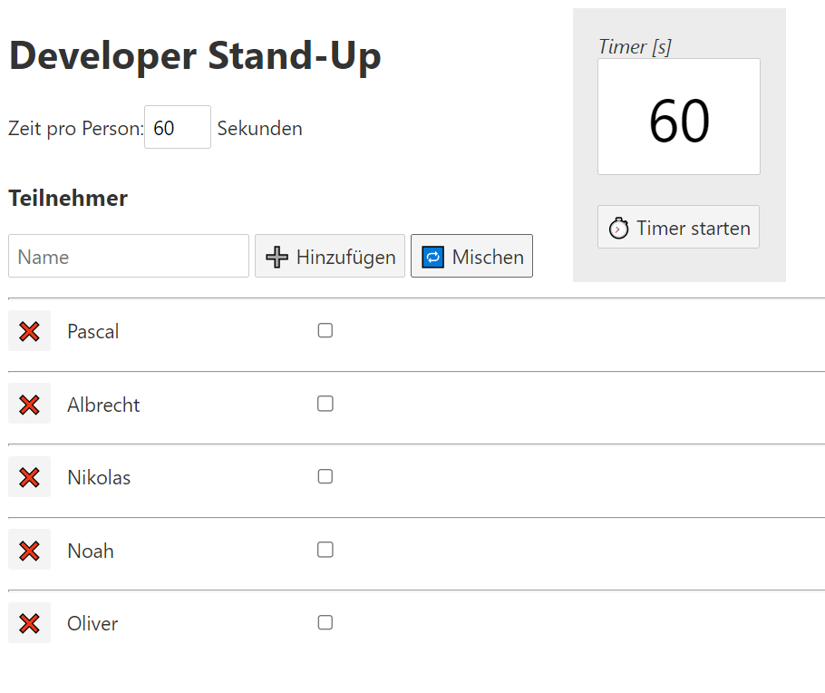

# Developer Stand-Up Timer

Web app to manage our company-wide developer stand-up meeting. It enables you to enter names, sort them randomly, and to start a timer.

Created with Svelte & Vite.

## Screenshot

## Recommended IDE Setup

[VS Code](https://code.visualstudio.com/) + [Svelte Extension](https://marketplace.visualstudio.com/items?itemName=svelte.svelte-vscode).
